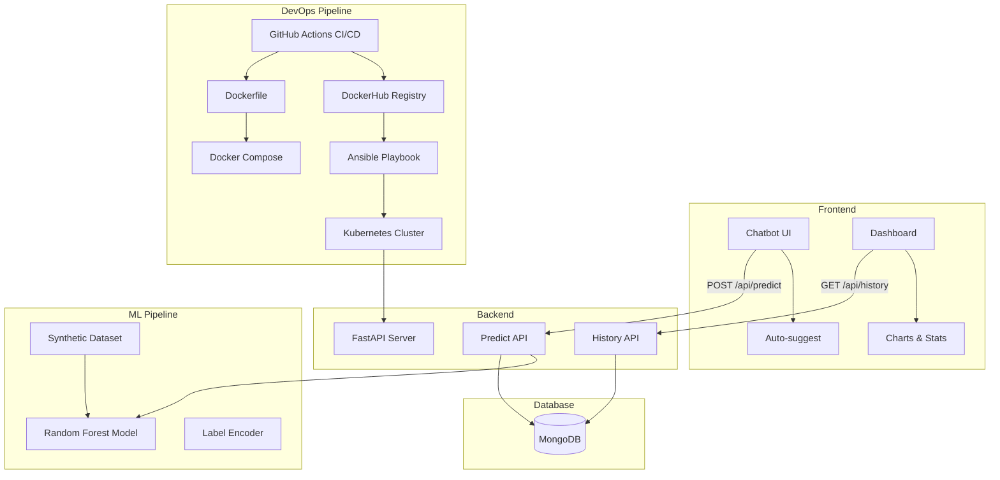
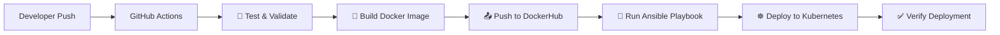

# 🛡️ HealthGuard AI — Intelligent Symptom Classification System

> AI-powered disease prediction from symptoms with a chatbot interface, built with FastAPI, scikit-learn, MongoDB, and Docker. Fully automated CI/CD with GitHub Actions, Ansible, and Kubernetes.


## 🏗️ Architecture



## ✨ Features

- 🤖 **Chatbot Interface** — Conversational symptom input with typing animations
- 🔍 **Smart Auto-suggest** — Fuzzy symptom search with autocomplete dropdown
- 🧠 **ML Predictions** — Random Forest classifier trained on 40 diseases & 132 symptoms
- 📊 **Analytics Dashboard** — Prediction history, statistics, and Chart.js visualizations
- 🐳 **Dockerized** — Multi-stage Docker build with Docker Compose
- ☸️ **Kubernetes** — Multi-replica deployment with rolling updates and health checks
- 🤖 **Ansible** — Automated infrastructure deployment playbook
- 🚀 **CI/CD** — Full GitHub Actions pipeline: Test → Build → Deploy → Verify
- 🌙 **Premium UI** — Dark mode, glassmorphism, and smooth animations

---

## 🚀 Quick Start

### Prerequisites

- Python 3.11+
- MongoDB (local or Atlas) — *optional, app works without it*
- Docker & Docker Compose — *for containerized deployment*
- Minikube + kubectl — *for Kubernetes deployment*
- Ansible — *for automated deployment*

### Local Development

```bash
# 1. Clone the repository
git clone https://github.com/your-username/healthguard-ai.git
cd healthguard-ai

# 2. Create virtual environment
python -m venv venv
venv\Scripts\activate        # Windows
# source venv/bin/activate   # macOS/Linux

# 3. Install dependencies
pip install -r requirements.txt

# 4. Train the ML model
python -m app.ml.train_model

# 5. Create .env file (optional)
copy .env.example .env

# 6. Start the server
uvicorn app.main:app --reload --port 8000
```

Open **http://localhost:8000** for the chatbot and **http://localhost:8000/dashboard** for analytics.

### Docker Deployment

```bash
# Build and start all services
docker-compose up --build

# Or run in background
docker-compose up --build -d
```

---

## ☸️ Kubernetes Deployment

### With Minikube (Local)

```bash
# 1. Start Minikube
minikube start

# 2. Build Docker image (use Minikube's Docker daemon)
eval $(minikube docker-env)            # Linux/macOS
# minikube docker-env --shell powershell | Invoke-Expression  # Windows PowerShell
docker build -t healthguard-ai:latest .

# 3. Update image in deployment.yaml
#    Replace YOUR_DOCKERHUB_USERNAME/healthguard-ai:latest with healthguard-ai:latest
#    Set imagePullPolicy to Never (for local images)

# 4. Apply Kubernetes manifests
kubectl apply -f k8s/deployment.yaml
kubectl apply -f k8s/service.yaml

# 5. Check status
kubectl get pods
kubectl get deployments
kubectl get services

# 6. Access the application
minikube service healthguard-ai-service --url
```

### With DockerHub Image

```bash
# 1. Build and push the image
docker build -t YOUR_DOCKERHUB_USERNAME/healthguard-ai:latest .
docker push YOUR_DOCKERHUB_USERNAME/healthguard-ai:latest

# 2. Update k8s/deployment.yaml with your DockerHub username

# 3. Apply manifests
kubectl apply -f k8s/deployment.yaml
kubectl apply -f k8s/service.yaml

# 4. Verify the deployment
kubectl rollout status deployment/healthguard-ai
```

### Kubernetes Manifests

| File | Description |
|------|-------------|
| `k8s/deployment.yaml` | 2-replica Deployment with rolling updates, health probes, resource limits |
| `k8s/service.yaml` | NodePort Service exposing the app on port 30080 |

---

## 🤖 Ansible Automation

### Run the Playbook

```bash
# Deploy to Kubernetes via Ansible
cd ansible
ansible-playbook deploy.yml

# Deploy with a specific Docker image
ansible-playbook deploy.yml -e "docker_image=myuser/healthguard-ai:v2"

# Dry-run (check mode)
ansible-playbook deploy.yml --check

# Syntax validation
ansible-playbook deploy.yml --syntax-check
```

### Ansible Files

| File | Description |
|------|-------------|
| `ansible/deploy.yml` | Main deployment playbook |
| `ansible/inventory.ini` | Inventory file (localhost) |
| `ansible/ansible.cfg` | Ansible configuration |

### What the Playbook Does

1. ✅ Verifies `kubectl` is available and cluster is reachable
2. 📦 Applies `k8s/deployment.yaml` to the cluster
3. 📦 Applies `k8s/service.yaml` to the cluster
4. 🔄 Triggers a rolling restart to pick up the new image
5. ⏳ Waits for the rollout to complete (120s timeout)
6. 📋 Displays pod, deployment, and service status

---

## ⚙️ CI/CD Pipeline

### Pipeline Architecture



### Pipeline Stages

| Stage | Job | Description |
|-------|-----|-------------|
| 1 | **Test & Validate** | Install deps, train ML model, verify artifacts, syntax check |
| 2 | **Build & Push** | Build Docker image, push to DockerHub with `latest` + `sha` tags |
| 3 | **Deploy via Ansible** | Install Ansible, configure kubectl, run deployment playbook |
| 4 | **Verify Deployment** | Check pods/services, run health check smoke test |

### Workflows

| Workflow | File | Trigger | Purpose |
|----------|------|---------|---------|
| K8s Pipeline | `.github/workflows/deploy.yml` | Push to `main` | Full K8s deployment pipeline |
| CI/CD Pipeline | `.github/workflows/ci-cd.yml` | Push/PR to `main` | Test, build, and deploy to Render |

### Required GitHub Secrets

Configure these in **Settings → Secrets and variables → Actions**:

| Secret | Description | Required For |
|--------|-------------|--------------|
| `DOCKER_USERNAME` | DockerHub username | Build & Push job |
| `DOCKER_PASSWORD` | DockerHub access token | Build & Push job |
| `KUBE_CONFIG` | Base64-encoded kubeconfig | Deploy & Verify jobs |
| `RENDER_DEPLOY_HOOK` | Render deploy webhook URL | ci-cd.yml (optional) |

#### How to Generate `KUBE_CONFIG`

```bash
# Encode your kubeconfig as base64
cat ~/.kube/config | base64 -w 0
# Copy the output and paste it as the KUBE_CONFIG secret value
```

---

## 🔄 Deployment Flow

```
Developer pushes code to GitHub (main branch)
        │
        ▼
GitHub Actions triggers the deploy.yml workflow
        │
        ▼
┌─────────────────────┐
│  🧪 Test & Validate │  Install deps → Train model → Verify artifacts
└─────────┬───────────┘
          ▼
┌─────────────────────┐
│  🐳 Build & Push    │  Docker build → Tag (latest + sha) → Push to DockerHub
└─────────┬───────────┘
          ▼
┌─────────────────────┐
│  🤖 Ansible Deploy  │  Install Ansible → Configure kubectl → Run playbook
│                     │  → Apply deployment.yaml → Apply service.yaml
│                     │  → Rolling restart → Wait for rollout
└─────────┬───────────┘
          ▼
┌─────────────────────┐
│  ✅ Verify          │  kubectl get pods → Health check → Summary
└─────────────────────┘
```

---

## 📡 API Endpoints

| Method | Endpoint | Description |
|--------|----------|-------------|
| `GET`  | `/` | Chatbot UI |
| `GET`  | `/dashboard` | Analytics dashboard |
| `POST` | `/api/predict` | Disease prediction |
| `GET`  | `/api/symptoms` | List all known symptoms |
| `GET`  | `/api/history` | Paginated prediction history |
| `GET`  | `/api/history/stats` | Aggregate statistics |
| `GET`  | `/api/health` | Health check |

### Example Request

```bash
curl -X POST http://localhost:8000/api/predict \
  -H "Content-Type: application/json" \
  -d '{"symptoms": ["headache", "fever", "fatigue"]}'
```

### Example Response

```json
{
  "disease": "Influenza",
  "confidence": 87.5,
  "top_predictions": [
    {"disease": "Influenza", "confidence": 87.5},
    {"disease": "Common Cold", "confidence": 8.2},
    {"disease": "COVID-19", "confidence": 3.1}
  ],
  "symptoms_used": ["headache", "fever", "fatigue"],
  "symptoms_matched": ["headache", "fever", "fatigue"],
  "disclaimer": "⚠️ This prediction is for educational/demo purposes only..."
}
```

---

## 🏗️ Project Structure

```
healthguard-ai/
├── .github/
│   └── workflows/
│       ├── ci-cd.yml              # CI/CD pipeline (Render deploy)
│       └── deploy.yml             # K8s deployment pipeline
├── ansible/
│   ├── ansible.cfg                # Ansible configuration
│   ├── deploy.yml                 # Deployment playbook
│   └── inventory.ini              # Inventory (localhost)
├── app/
│   ├── main.py                    # FastAPI entry point
│   ├── config.py                  # Environment configuration
│   ├── models/prediction.py       # Pydantic schemas
│   ├── routes/
│   │   ├── predict.py             # /api/predict endpoint
│   │   └── history.py             # /api/history endpoint
│   ├── services/
│   │   ├── ml_service.py          # ML model inference
│   │   └── db_service.py          # MongoDB operations
│   └── ml/
│       ├── train_model.py         # Dataset generation + training
│       ├── medicine_map.py        # Disease → medicine mapping
│       ├── model.joblib           # Trained model (generated)
│       ├── label_encoder.joblib   # Label encoder (generated)
│       └── symptom_list.json      # Symptom names (generated)
├── frontend/
│   ├── index.html                 # Chatbot page
│   ├── dashboard.html             # Dashboard page
│   ├── css/style.css              # Premium dark theme
│   └── js/
│       ├── chat.js                # Chatbot logic
│       └── dashboard.js           # Dashboard logic
├── k8s/
│   ├── deployment.yaml            # Kubernetes Deployment (2 replicas)
│   └── service.yaml               # Kubernetes Service (NodePort)
├── Dockerfile                     # Multi-stage Docker build
├── docker-compose.yml             # Full-stack orchestration
├── requirements.txt               # Python dependencies
├── .env                           # Environment variables
├── .env.example                   # Environment template
├── .dockerignore                  # Docker build exclusions
└── .gitignore                     # Git exclusions
```

---

## 🔍 Verification Commands

After deploying to Kubernetes, use these commands to verify:

```bash
# ─── Pod Status ──────────────────────────────────────────
kubectl get pods -l app=healthguard-ai -o wide

# ─── Deployment Status ───────────────────────────────────
kubectl get deployments

# ─── Service Status ──────────────────────────────────────
kubectl get services

# ─── Rollout Status ──────────────────────────────────────
kubectl rollout status deployment/healthguard-ai

# ─── Pod Logs ────────────────────────────────────────────
kubectl logs -l app=healthguard-ai --tail=50

# ─── Describe Deployment ────────────────────────────────
kubectl describe deployment healthguard-ai

# ─── Health Check ────────────────────────────────────────
# Via port-forward
kubectl port-forward svc/healthguard-ai-service 8080:80
curl http://localhost:8080/api/health

# Via Minikube
minikube service healthguard-ai-service --url

# ─── Scaling ─────────────────────────────────────────────
kubectl scale deployment healthguard-ai --replicas=3

# ─── Rolling Update ──────────────────────────────────────
kubectl set image deployment/healthguard-ai \
  healthguard-ai=YOUR_DOCKERHUB_USERNAME/healthguard-ai:new-tag
```

---

## 🔐 Environment Variables

| Variable | Default | Description |
|----------|---------|-------------|
| `MONGODB_URI` | `mongodb://localhost:27017` | MongoDB connection string |
| `DATABASE_URL` | `mongodb://localhost:27017/healthcare_db` | Full database URL |
| `DATABASE_NAME` | `healthcare_db` | MongoDB database name |
| `MODEL_PATH` | `app/ml/model.joblib` | Path to trained ML model |
| `APP_PORT` | `8000` | Application port |
| `DOCKER_IMAGE_NAME` | `healthguard-ai` | Docker image name |

---

## 🛠️ Technology Stack

| Layer | Technology |
|-------|------------|
| **Backend** | FastAPI (Python 3.11) |
| **Machine Learning** | scikit-learn (Random Forest) |
| **Database** | MongoDB |
| **Frontend** | HTML/CSS/JavaScript |
| **Containerization** | Docker (multi-stage build) |
| **Orchestration** | Kubernetes |
| **Automation** | Ansible |
| **CI/CD** | GitHub Actions |
| **Registry** | DockerHub |
| **Local Cluster** | Minikube |

---

## ⚠️ Disclaimer

> This application is for **educational and demonstration purposes only**. It does NOT provide real medical advice. Always consult a qualified healthcare professional for medical concerns.

## 📄 License

MIT License — feel free to use and modify for your projects.
# devops-project

