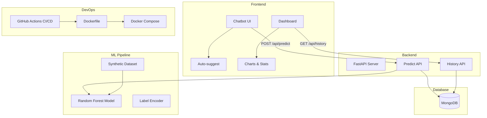

# 🛡️ HealthGuard AI — Intelligent Symptom Classification System

> AI-powered disease prediction from symptoms with a chatbot interface, built with FastAPI, scikit-learn, MongoDB, and Docker.


## 🏗️ Architecture



## ✨ Features

- 🤖 **Chatbot Interface** — Conversational symptom input with typing animations
- 🔍 **Smart Auto-suggest** — Fuzzy symptom search with autocomplete dropdown
- 🧠 **ML Predictions** — Random Forest classifier trained on 40 diseases & 132 symptoms
- 📊 **Analytics Dashboard** — Prediction history, statistics, and Chart.js visualizations
- 🐳 **Dockerized** — Multi-stage Docker build with Docker Compose
- 🚀 **CI/CD** — Automated testing, building, and deployment via GitHub Actions
- 🌙 **Premium UI** — Dark mode, glassmorphism, and smooth animations

## 🚀 Quick Start

### Prerequisites

- Python 3.11+
- MongoDB (local or Atlas) — *optional, app works without it*
- Docker & Docker Compose — *for containerized deployment*

### Local Development

```bash
# 1. Clone the repository
git clone https://github.com/your-username/healthguard-ai.git
cd healthguard-ai

# 2. Create virtual environment
python -m venv venv
venv\Scripts\activate        # Windows
# source venv/bin/activate   # macOS/Linux

# 3. Install dependencies
pip install -r requirements.txt

# 4. Train the ML model
python -m app.ml.train_model

# 5. Create .env file (optional)
copy .env.example .env

# 6. Start the server
uvicorn app.main:app --reload --port 8000
```

Open **http://localhost:8000** for the chatbot and **http://localhost:8000/dashboard** for analytics.

### Docker Deployment

```bash
# Build and start all services
docker-compose up --build

# Or run in background
docker-compose up --build -d
```

## 📡 API Endpoints

| Method | Endpoint | Description |
|--------|----------|-------------|
| `GET`  | `/` | Chatbot UI |
| `GET`  | `/dashboard` | Analytics dashboard |
| `POST` | `/api/predict` | Disease prediction |
| `GET`  | `/api/symptoms` | List all known symptoms |
| `GET`  | `/api/history` | Paginated prediction history |
| `GET`  | `/api/history/stats` | Aggregate statistics |
| `GET`  | `/api/health` | Health check |

### Example Request

```bash
curl -X POST http://localhost:8000/api/predict \
  -H "Content-Type: application/json" \
  -d '{"symptoms": ["headache", "fever", "fatigue"]}'
```

### Example Response

```json
{
  "disease": "Influenza",
  "confidence": 87.5,
  "top_predictions": [
    {"disease": "Influenza", "confidence": 87.5},
    {"disease": "Common Cold", "confidence": 8.2},
    {"disease": "COVID-19", "confidence": 3.1}
  ],
  "symptoms_used": ["headache", "fever", "fatigue"],
  "symptoms_matched": ["headache", "fever", "fatigue"],
  "disclaimer": "⚠️ This prediction is for educational/demo purposes only..."
}
```

## 🏗️ Project Structure

```
├── .github/workflows/ci-cd.yml    # GitHub Actions pipeline
├── app/
│   ├── main.py                    # FastAPI entry point
│   ├── config.py                  # Environment configuration
│   ├── models/prediction.py       # Pydantic schemas
│   ├── routes/
│   │   ├── predict.py             # /api/predict endpoint
│   │   └── history.py             # /api/history endpoint
│   ├── services/
│   │   ├── ml_service.py          # ML model inference
│   │   └── db_service.py          # MongoDB operations
│   └── ml/
│       ├── train_model.py         # Dataset generation + training
│       ├── model.joblib           # Trained model (generated)
│       ├── label_encoder.joblib   # Label encoder (generated)
│       └── symptom_list.json      # Symptom names (generated)
├── frontend/
│   ├── index.html                 # Chatbot page
│   ├── dashboard.html             # Dashboard page
│   ├── css/style.css              # Premium dark theme
│   └── js/
│       ├── chat.js                # Chatbot logic
│       └── dashboard.js           # Dashboard logic
├── Dockerfile                     # Multi-stage Docker build
├── docker-compose.yml             # Full-stack orchestration
├── requirements.txt               # Python dependencies
└── .env.example                   # Environment template
```

## ⚙️ CI/CD Pipeline

The GitHub Actions workflow (`.github/workflows/ci-cd.yml`) runs on every push to `main`:

1. **🧪 Test** — Install deps, train model, verify artifacts
2. **🐳 Build** — Build Docker image & push to Docker Hub
3. **🚀 Deploy** — Trigger deployment on Render

### Required Secrets

| Secret | Description |
|--------|-------------|
| `DOCKER_USERNAME` | Docker Hub username |
| `DOCKER_PASSWORD` | Docker Hub access token |
| `RENDER_DEPLOY_HOOK` | Render deploy webhook URL (optional) |

## ⚠️ Disclaimer

> This application is for **educational and demonstration purposes only**. It does NOT provide real medical advice. Always consult a qualified healthcare professional for medical concerns.

## 📄 License

MIT License — feel free to use and modify for your projects.
